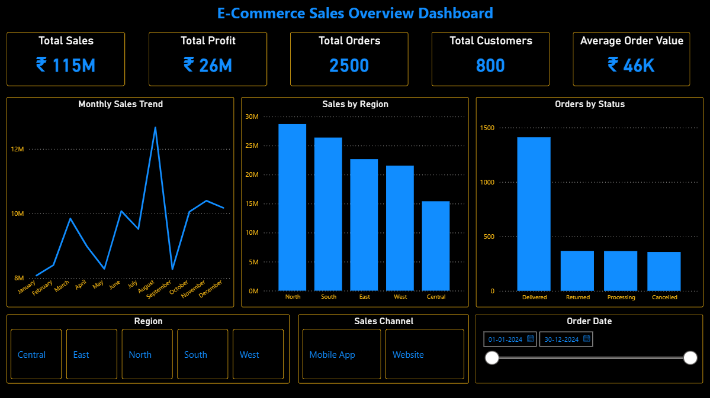
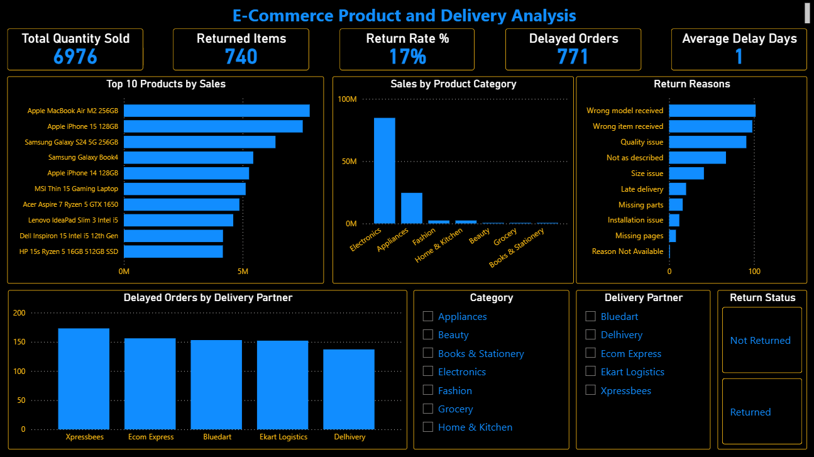
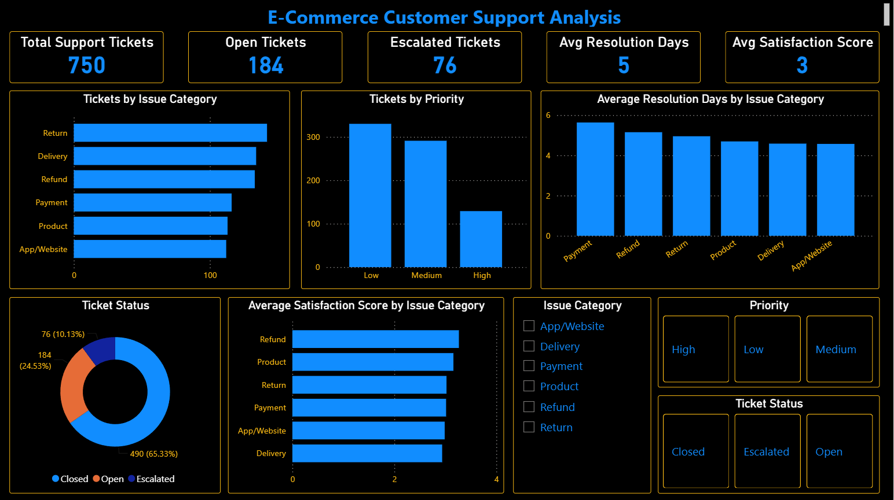

# E-Commerce Sales and Customer Support Analytics

## Project Overview

This project analyzes e-commerce sales, product performance, delivery delays, returns, and customer support tickets.

The goal of this project is to help an e-commerce business understand:

- Overall sales and profit performance
- Monthly sales trends
- Region-wise sales performance
- Product category performance
- Top-selling products
- Product return reasons
- Delivery partner delays
- Customer support issues
- Customer satisfaction and resolution performance

The project uses Python, SQL, and Power BI to convert raw data into business insights and dashboard visuals.

---

## Business Problem

An e-commerce company sells products through its website and mobile app. The business has data related to customers, products, orders, deliveries, returns, and support tickets.

However, the company needs a clear view of sales performance, delivery problems, return reasons, and customer complaints.

This project solves that problem by analyzing the data and creating a Power BI dashboard for business decision-making.

---

## Tools Used

- Python
- pandas
- NumPy
- SQL / MySQL
- Power BI
- Excel
- Git and GitHub

---

## Dataset

The dataset is a realistic synthetic e-commerce dataset created for portfolio learning.

It contains the following files:

- customers.csv
- products.csv
- orders.csv
- order_items.csv
- deliveries.csv
- support_tickets.csv

Cleaned datasets are stored in:

`data/cleaned/`

---

## Project Workflow

### 1. Project Understanding

Defined the business problem, objectives, business questions, and expected dashboard outcomes.

### 2. Dataset Preparation

Created realistic e-commerce raw CSV files with customers, products, orders, deliveries, returns, and support ticket data.

### 3. Data Dictionary

Created a data dictionary explaining table names, column names, data types, descriptions, and relationships.

### 4. Data Understanding

Used Python and pandas to check:

- Rows and columns
- Column names
- Data types
- Missing values
- Duplicate rows
- Basic numeric summary
- Unique values

Notebook:

`notebooks/01_data_understanding.ipynb`

### 5. Data Cleaning

Cleaned the raw datasets using Python and pandas.

Main cleaning tasks:

- Removed duplicate rows
- Cleaned extra spaces in text columns
- Standardized text formatting
- Converted date columns into proper date format
- Converted numeric columns into numeric format
- Fixed negative quantity values
- Filled missing return reason for returned items
- Recalculated revenue and profit
- Saved cleaned files in `data/cleaned/`

Notebook:

`notebooks/02_data_cleaning.ipynb`

### 6. Data Validation

Performed basic validation checks on cleaned data.

Validation checks included:

- Duplicate primary ID checks
- Missing important ID checks
- Customer ID matching
- Order ID matching
- Product ID matching
- Quantity and revenue validation
- Rating validation
- Delivery date validation
- Support ticket date validation
- Return reason validation

Notebook:

`notebooks/03_basic_validation.ipynb`

### 7. Exploratory Data Analysis

Performed EDA using Python and pandas.

Analysis included:

- Basic business KPIs
- Monthly sales trend
- Category-wise sales
- Region-wise sales
- Top 10 products by sales
- Return reason analysis
- Delivery delay analysis
- Support ticket analysis

Notebook:

`notebooks/04_exploratory_analysis.ipynb`

### 8. SQL Business Analysis

Created SQL queries to answer business questions.

SQL analysis included:

- Total sales and profit
- Monthly sales
- Region-wise sales
- Product category sales
- Top products by sales and profit
- Return reasons
- Delivery delays
- Support ticket analysis
- Customer satisfaction analysis

SQL file:

`sql/basic_business_queries.sql`

### 9. Power BI Dashboard

Created a Power BI dashboard with three pages:

1. Sales Overview
2. Product and Delivery Analysis
3. Customer Support Analysis

Power BI file:

`powerbi/ecommerce_dashboard.pbix`

Dashboard screenshots:

`powerbi/dashboard_screenshots/`

### 10. AI Bonus Feature

Added a simple AI-style support ticket auto-tagging feature.

The feature predicts:

- Issue category
- Ticket priority

based on customer issue descriptions.

Notebook:

`notebooks/05_ai_bonus_support_ticket_auto_tagging.ipynb`

Output:

`ai_bonus/ticket_auto_tagging_output.csv`

Note: This is a beginner-friendly keyword-based automation, not a production-level AI model.

---

## Power BI Dashboard

### Page 1: Sales Overview

This page gives a high-level view of business performance.

It includes:

- Total Sales
- Total Profit
- Total Orders
- Total Customers
- Average Order Value
- Monthly Sales Trend
- Sales by Region
- Orders by Status



---

### Page 2: Product and Delivery Analysis

This page focuses on product performance, returns, and delivery delays.

It includes:

- Total Quantity Sold
- Returned Items
- Return Rate
- Delayed Orders
- Average Delay Days
- Top 10 Products by Sales
- Sales by Product Category
- Return Reasons
- Delayed Orders by Delivery Partner



---

### Page 3: Customer Support Analysis

This page focuses on support tickets and customer issue resolution.

It includes:

- Total Support Tickets
- Open Tickets
- Escalated Tickets
- Average Resolution Days
- Average Satisfaction Score
- Tickets by Issue Category
- Tickets by Priority
- Ticket Status
- Average Resolution Days by Issue Category
- Average Satisfaction Score by Issue Category



---

## Key Business Insights

- The business generated strong sales, mainly driven by electronics products.
- North and South regions contributed the highest sales.
- August showed the highest monthly sales.
- Electronics was the strongest revenue-generating category.
- Top-selling products were mainly laptops and smartphones.
- Return rate was around 17%, which indicates a need to improve product quality, listing accuracy, and delivery handling.
- Major return reasons included wrong model received, wrong item received, quality issue, and product mismatch.
- Xpressbees had the highest delayed orders among delivery partners.
- Most support tickets were related to returns, delivery, and refunds.
- Average satisfaction score was moderate, showing scope for improvement in support and post-purchase experience.

---

## Business Recommendations

- Focus on high-performing electronics products.
- Improve sales in the Central region through targeted campaigns.
- Reduce returns by improving product listing accuracy and seller quality checks.
- Improve packaging and warehouse picking to reduce wrong item and damaged product issues.
- Monitor delivery partner delays regularly.
- Improve refund and return support processes.
- Track open and escalated support tickets daily.
- Use dashboard KPIs regularly to monitor sales, returns, delivery, and customer support performance.

---

## Folder Structure

```text
ecommerce-sales-support-analytics/
│
├── README.md
├── .gitignore
│
├── data/
│   ├── raw/
│   └── cleaned/
│
├── notebooks/
│   ├── 01_data_understanding.ipynb
│   ├── 02_data_cleaning.ipynb
│   ├── 03_basic_validation.ipynb
│   ├── 04_exploratory_analysis.ipynb
│   └── 05_ai_bonus_support_ticket_auto_tagging.ipynb
│
├── sql/
│   └── basic_business_queries.sql
│
├── powerbi/
│   ├── ecommerce_dashboard.pbix
│   ├── dashboard_screenshots/
│   │   ├── 01_sales_overview.png
│   │   ├── 02_product_delivery_analysis.png
│   │   └── 03_customer_support_analysis.png
│   ├── kpi_plan.md
│   ├── dax_measures.txt
│   ├── dashboard_design_plan.md
│   └── dashboard_build_checklist.md
│
├── ai_bonus/
│   ├── ai_bonus_summary.md
│   └── ticket_auto_tagging_output.csv
│
└── reports/
    └── business_insights_and_recommendations.md
```

---

## Skills Demonstrated

- Data cleaning using Python and pandas
- Handling missing values and duplicate records
- Data validation
- Exploratory data analysis
- SQL business analysis
- Power BI dashboard creation
- DAX measure creation
- Business insight generation
- Dashboard storytelling
- GitHub project documentation
- Simple AI-style automation using Python

---

## Project Status

Completed.

